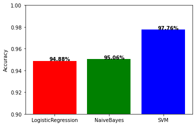
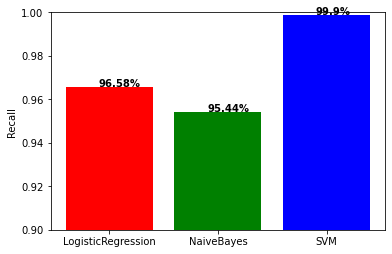
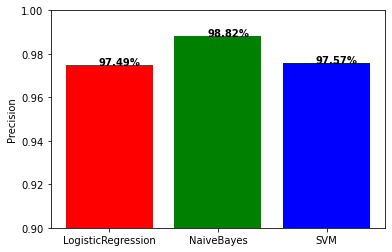

# Building a Spam Classifier Machine Learning Pipeline Using Apache Spark's ML Libary

```python
from pyspark import SparkConf
from pyspark.ml import Pipeline, PipelineModel
from pyspark.ml.feature import HashingTF, IDF, Tokenizer, RegexTokenizer, StopWordsRemover
from pyspark.sql import SparkSession, functions, types
from pyspark.ml.classification import LogisticRegression, LinearSVC, NaiveBayes
from pyspark.ml.evaluation import MulticlassClassificationEvaluator
import matplotlib.pyplot as plt
%matplotlib inline
```

First, the current version of Spark ML library is based on dataframe, and its entry point is **SparkSession**.

then I read the data, and use **withColumn()** to add the label column.

And **union()** is used to put the data of positive and negative labels together.


```python
spark = SparkSession.builder.master("local").appName("Classification").getOrCreate()
readData = lambda path, label: spark.read.text(path).withColumn("label", functions.lit(label))
pTrain = readData("./spam-datasets/spam_training.txt",1)
nTrain = readData("./spam-datasets/nospam_training.txt",0)
pTest = readData("./spam-datasets/spam_testing.txt",1)
nTest = readData("./spam-datasets/nospam_testing.txt",0)
trainSet = pTrain.union(nTrain).cache()
testSet = pTest.union(nTest).cache()
```

Spam Messages

```python
pTrain.show(20,100)
```

    +----------------------------------------------------------------------------------------------------+-----+
    |                                                                                               value|label|
    +----------------------------------------------------------------------------------------------------+-----+
    |You have been specially selected to receive a 2000 pound award! Call 08712402050 BEFORE the lines...|    1|
    |Not heard from U4 a while. Call 4 rude chat private line 01223585334 to cum. Wan 2C pics of me ge...|    1|
    |Hello. We need some posh birds and chaps to user trial prods for champneys. Can i put you down? I...|    1|
    |                             500 free text msgs. Just text ok to 80488 and we'll credit your account|    1|
    |WIN URGENT! Your mobile number has been awarded with a £2000 prize GUARANTEED call 09061790121 fr...|    1|
    |Hi, this is Mandy Sullivan calling from HOTMIX FM...you are chosen to receive £5000.00 in our Eas...|    1|
    |URGENT! Your Mobile number has been awarded with a £2000 Bonus Caller Prize. Call 09058095201 fro...|    1|
    |                            Missed call alert. These numbers called but left no message. 07008009200|    1|
    |YOU HAVE WON! As a valued Vodafone customer our computer has picked YOU to win a £150 prize. To c...|    1|
    |cmon babe, make me horny, *turn* me on! Txt me your fantasy now babe -) Im hot, sticky and need y...|    1|
    |Moby Pub Quiz.Win a £100 High Street prize if u know who the new Duchess of Cornwall will be? Txt...|    1|
    |                          it to 80488. Your 500 free text messages are valid until 31 December 2005.|    1|
    |URGENT! Your mobile was awarded a £1,500 Bonus Caller Prize on 27/6/03. Our final attempt 2 conta...|    1|
    |Hi its LUCY Hubby at meetins all day Fri & I will B alone at hotel U fancy cumin over? Pls leave ...|    1|
    |Had your mobile 11 months or more? U R entitled to Update to the latest colour mobiles with camer...|    1|
    |5 Free Top Polyphonic Tones call 087018728737, National Rate. Get a toppoly tune sent every week,...|    1|
    |SMS SERVICES. for your inclusive text credits, pls goto www.comuk.net login= ***** unsubscribe wi...|    1|
    |Well done ENGLAND! Get the official poly ringtone or colour flag on yer mobile! text TONE or FLAG...|    1|
    |Ur cash-balance is currently 500 pounds - to maximize ur cash-in now send GO to 86688 only 150p/m...|    1|
    |22 days to kick off! For Euro2004 U will be kept up to date with the latest news and results dail...|    1|
    +----------------------------------------------------------------------------------------------------+-----+
    only showing top 20 rows
    
Not Spam Messages

```python
nTrain.show(20,100)
```

    +----------------------------------------------------------------------------------------------------+-----+
    |                                                                                               value|label|
    +----------------------------------------------------------------------------------------------------+-----+
    |                                                             If you have belive me. Come to my home.|    0|
    |                                                                   Are you planning to come chennai?|    0|
    |Hi its me you are probably having too much fun to get this message but i thought id txt u cos im ...|    0|
    |                                                          2marrow only. Wed at  &lt;#&gt;  to 2 aha.|    0|
    |                                                                                               Ok...|    0|
    |For real when u getting on yo? I only need 2 more tickets and one more jacket and I'm done. I alr...|    0|
    |                                                                                     How's ur paper?|    0|
    |                                                                           K I'm ready,  &lt;#&gt; ?|    0|
    |                                                                                   I anything lor...|    0|
    |                                                                     Shall call now dear having food|    0|
    |                                    Boo I'm on my way to my moms. She's making tortilla soup. Yummmm|    0|
    |                                             Where are the garage keys? They aren't on the bookshelf|    0|
    |                                          Awesome, think we can get an 8th at usf some time tonight?|    0|
    |                                          Sounds gd... Haha... Can... Wah, u yan jiu so fast liao...|    0|
    |                                          What you thinked about me. First time you saw me in class.|    0|
    |                             Okie ü wan meet at bishan? Cos me at bishan now. I'm not driving today.|    0|
    |                                                                      At 4. Let's go to bill millers|    0|
    |Ok that would b lovely, if u r sure. Think about wot u want to do, drinkin, dancin, eatin, cinema...|    0|
    |NEFT Transaction with reference number  &lt;#&gt;  for Rs. &lt;DECIMAL&gt;  has been credited to ...|    0|
    |                                  A few people are at the game, I'm at the mall with iouri and kaila|    0|
    +----------------------------------------------------------------------------------------------------+-----+
    only showing top 20 rows
    


**RegexTokenizer()** used regular expressions to remove all words with numbers, links, and all punctuation that has no effect on the meaning of the word: i.e. all punctuation except hyphens and apostrophes.

**StopWordsRemover()** is used to remove so-called "stop words", such as 'the', 'is', 'at' … which appear very frequently but have little concret meaning.

Spark uses **HashingTF()** to calculate TF values: it maps each word to indices using a hash function and calculates their frequencies. Then apply IDF to penalize the effect of words that appear in many lines.


```python
tokenizer = RegexTokenizer(pattern="[^a-z0-9A-Z\-\']|https?://\S+|www\.\S+|\w*\d\w*", 
                           inputCol="value", outputCol="words_s")
remover = StopWordsRemover(inputCol="words_s", outputCol="words")
hashingTF = HashingTF(inputCol="words", outputCol="rawFeatures", numFeatures=16384)
idf = IDF(inputCol="rawFeatures", outputCol="features")
```

Then I built the machine learning pipeline using spark's **Pipeline()**, which chained together the data preprocessing: **RegexTokenizer()**, **StopWordsRemover()** and feature extraction/weighting processes: **HashingTF()**, **IDF()**), while I put the estimators at the end, aka machine learning (classification) algorithms.

I used three different classification algorithms: logistic regression: **LogisticRegression()**, naive bayes: **NaiveBayes()**, support vector machine: **LinearSVC()**.

Then I put the training set into the pipeline and complete the training process by using **fit()** to get the model


```python
pipelineFit = lambda estimator: Pipeline(stages=[tokenizer, remover, hashingTF, 
                                                 idf, estimator]).fit(trainSet)
lr = LogisticRegression()
nb = NaiveBayes()
svm = LinearSVC()
lrModel = pipelineFit(lr)
nbModel = pipelineFit(nb)
svmModel = pipelineFit(svm)
```

    22/07/07 23:42:00 WARN BLAS: Failed to load implementation from: com.github.fommil.netlib.NativeSystemBLAS
    22/07/07 23:42:00 WARN BLAS: Failed to load implementation from: com.github.fommil.netlib.NativeRefBLAS
                                                                                    

After that I use the model to predict by using **predict()** the results based on the test data


```python
predict = lambda model: model.transform(testSet).select("prediction", "label")
lrPredictions = predict(lrModel)
nbPredictions = predict(nbModel)
svmPredictions = predict(svmModel)
```

I use **MulticlassClassificationEvaluator()** to evaluate by using the **evaluate()** prediction results. First, I choose three metrics: 

**accuracy**: the proportion of correct predictions to all predictions; 

**recallByLabel**: the proportion of correct positives to all positive predictions; 

**precisionByLabel**: the proportion of correct positives to all positives.


```python
getMetric = lambda predictions, metric: MulticlassClassificationEvaluator(metricName=metric).evaluate(predictions)
getMetrics = lambda predictions: (getMetric(predictions, "accuracy"), getMetric(predictions, "recallByLabel"), 
                                  getMetric(predictions, "precisionByLabel"))

lr_acc, lr_rec, lr_pre = getMetrics(lrPredictions)
nb_acc, nb_rec, nb_pre = getMetrics(nbPredictions)
svm_acc, svm_rec, svm_pre = getMetrics(svmPredictions)
```

I compare the results of the three models through bar chart, based on the three metrics mentioned above


```python
def plot_bar(y, label): 
    fig, ax = plt.subplots()
    labels = ["LogisticRegression", "NaiveBayes", "SVM"]
    colors = ["red","green","blue"]
    ax.bar(range(3), y, tick_label=labels, color=colors)
    ax.set_ylabel(label)
    for i,v in enumerate(y):
        ax.text(i-.1, v, str(round(v*100,2))+"%", fontweight='bold')
    plt.ylim(0.9,1)
    plt.show()
```

It can be seen that the SVM results are the best and the logistic regression the worst: in this example, the more complex model has an advantage.


```python
plot_bar([lr_acc, nb_acc, svm_acc], "Accuracy")
plot_bar([lr_rec, nb_rec, svm_rec], "Recall")
plot_bar([lr_pre, nb_pre, svm_pre], "Precision")
```


    

    


    

    


    

    


```python

```
